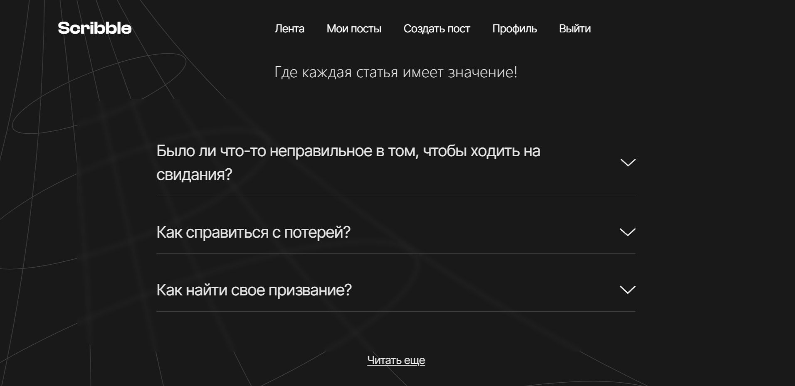
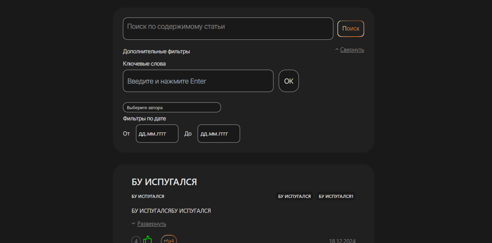
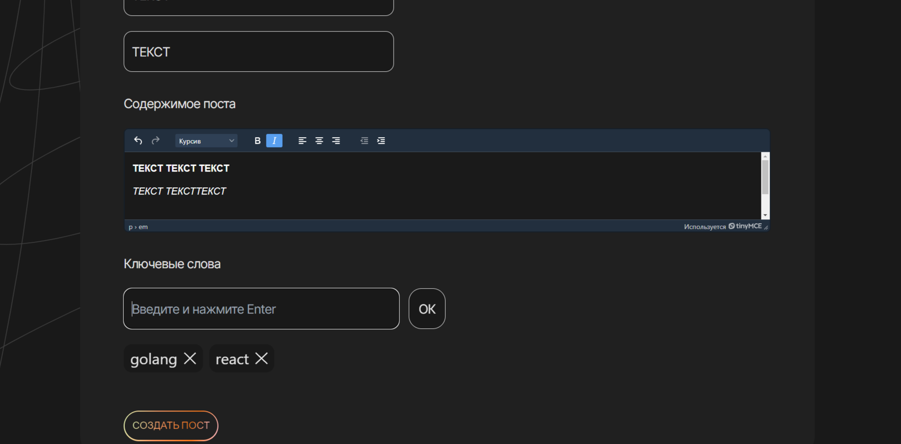
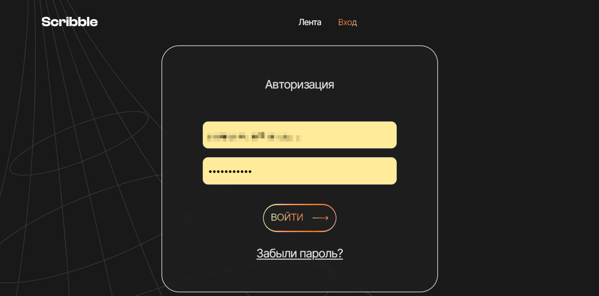
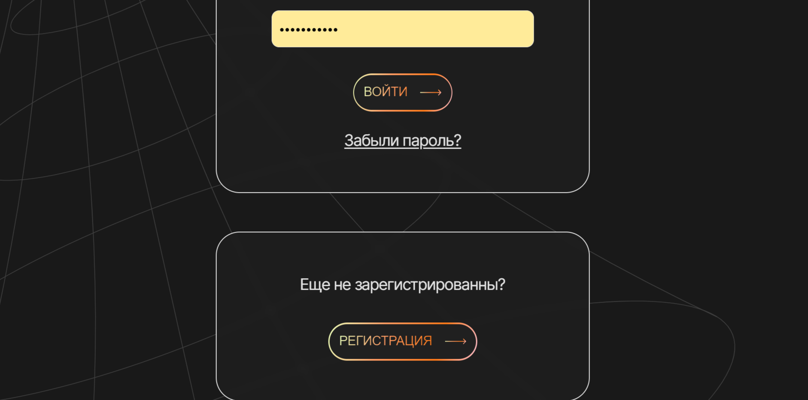
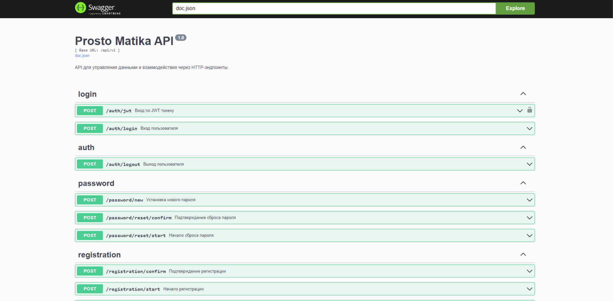
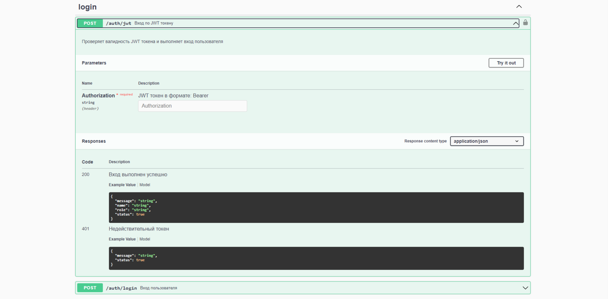

# 📝 Scribble - Платформа для Блогов

Scribble - это современная платформа для ведения блогов, разработанная с использованием React и Go. Проект предоставляет удобный интерфейс для создания, редактирования и просмотра статей, с поддержкой тегов, лайков и фильтрации контента.



## ✨ Основные возможности

- 🔐 Аутентификация и авторизация пользователей
- 📝 Создание и редактирование статей с rich-text редактором
- 🏷️ Поддержка тегов для категоризации контента
- ❤️ Система лайков
- 🔍 Продвинутая фильтрация и поиск контента
- 📱 Адаптивный дизайн

### Лента постов и фильтрация



### Создание постов


### Система авторизации



## 🛠 Технический стек

### Frontend
- React + TypeScript
- Tailwind CSS для стилизации
- React Router для навигации
- Axios для HTTP-запросов
- TinyMCE для rich-text редактирования

### Backend
- Go (Golang)
- GORM для работы с базой данных
- PostgreSQL
- JWT для аутентификации
- Swagger для API документации




## 🚀 Быстрый старт

### Предварительные требования

- Go 1.22+
- Node.js 18+
- PostgreSQL 14+
- SMTP-сервер для отправки email

### Настройка базы данных

```sql
CREATE DATABASE scribble;
CREATE USER scribble_user WITH PASSWORD '123456';
GRANT ALL PRIVILEGES ON DATABASE scribble TO scribble_user;
```

### Настройка Backend

1. Создайте файл `.env` в директории `back`:

```env
# WEB APP CONFIG
APP_IP=localhost
APP_PORT=8080
APP_URL=http://localhost:8080
APP_JWT_SECRET=your_secret_key

# DATABASE CONFIG
DBHOST=localhost
DBPORT=5432
DBNAME=scribble
DBUSER=scribble_user
DBPASS=123456
DBSSLMODE=disable

# SMTP CONFIG
SMTP_SERVER=smtp.yandex.ru
SMTP_MAIL_NAME=your_email@yandex.ru
SMTP_SSL_PORT=465
SMTP_PASSWORD=your_password
SMTP_PAUSE=1000

# AUTH CACHE
AUTH_TIME_TO_LIVE=15
AUTH_CLEANUP_INTERVAL=30
```

2. Запустите backend:

```bash
cd back
go mod download
go run main.go
```

### Настройка Frontend

1. Создайте файл `.env` в директории `front`:

```env
VITE_API_KEY=your_api_key
```

2. Установите зависимости и запустите:

```bash
cd front
npm install
npm run dev
```

## 📚 Документация API

Swagger UI доступен по адресу:
```
http://localhost:8080/swagger/index.html
```
